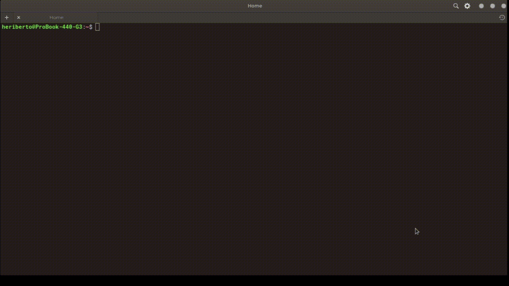

# Terminal elementaryOS
Script for change Theme Color on Terminal

## How to Install

* Download theme.sh

* Name it as 'theme'

* Place it in /usr/bin/

```
sudo mv theme /usr/bin
```

* Execute on your Shell_prompt

```
$ theme
```


